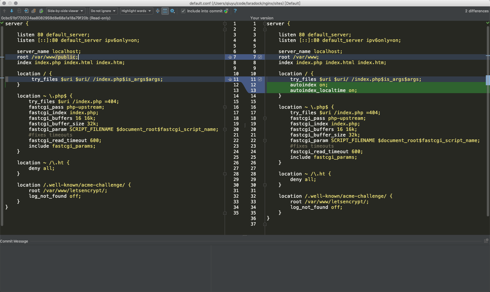
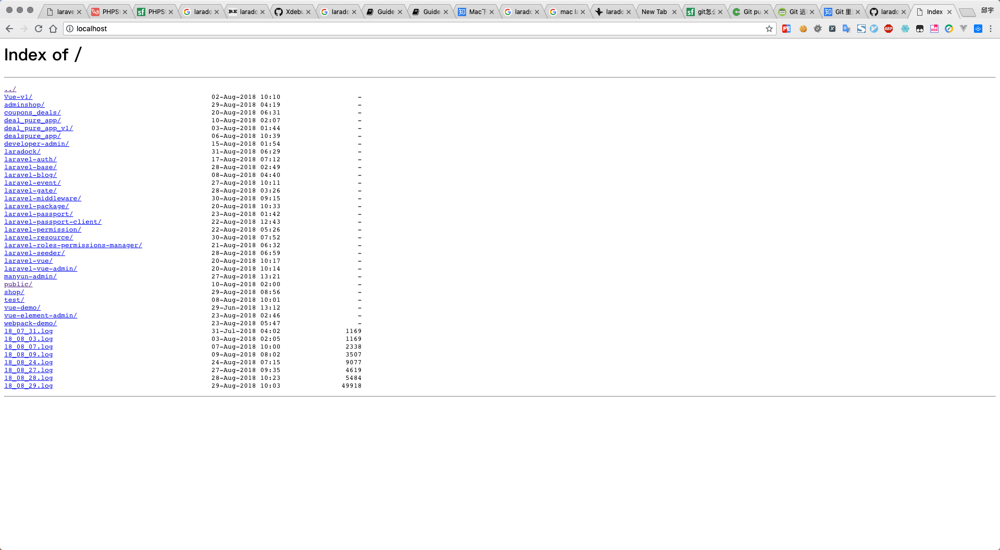
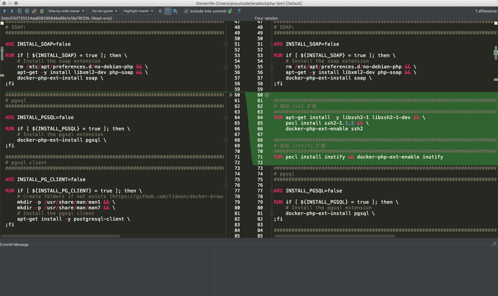
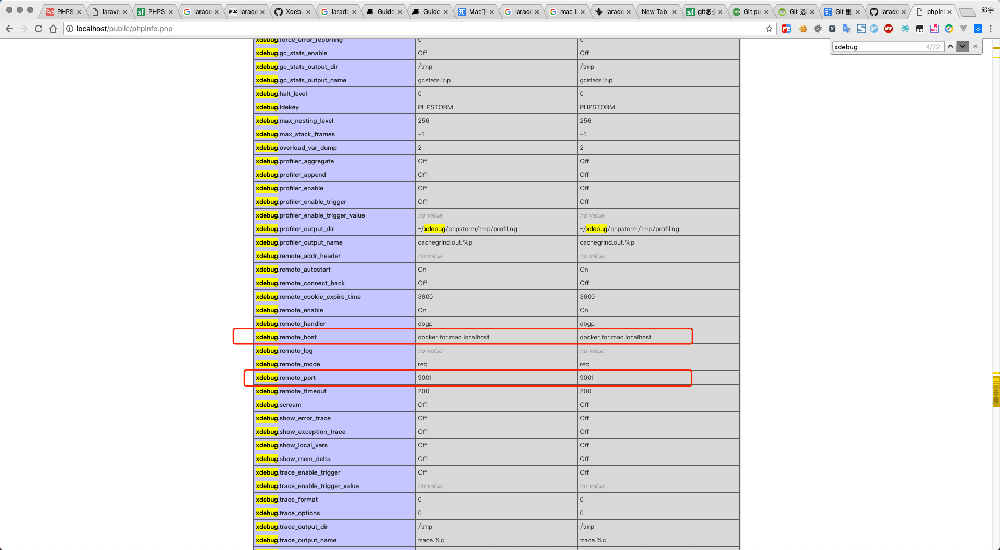
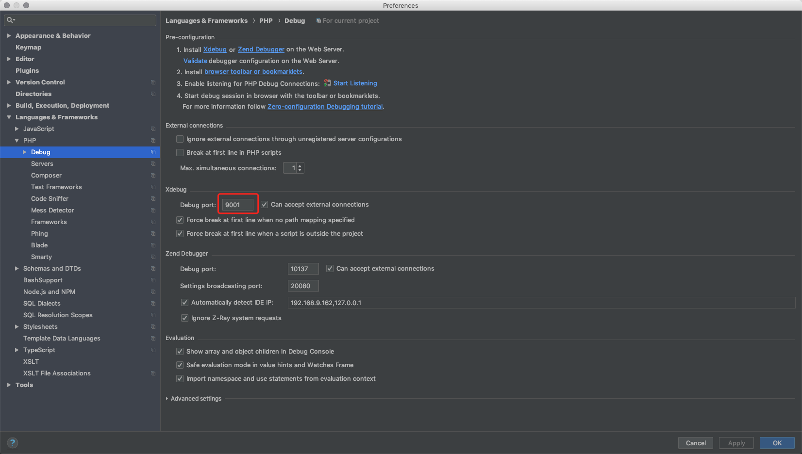
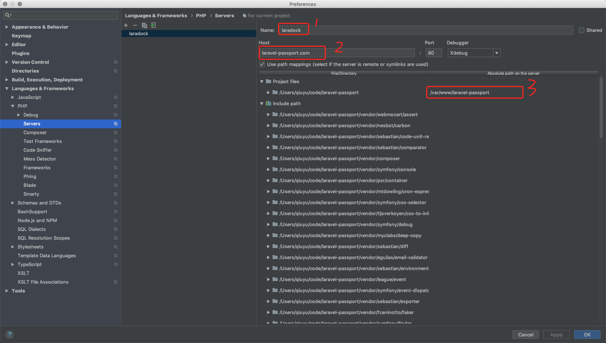
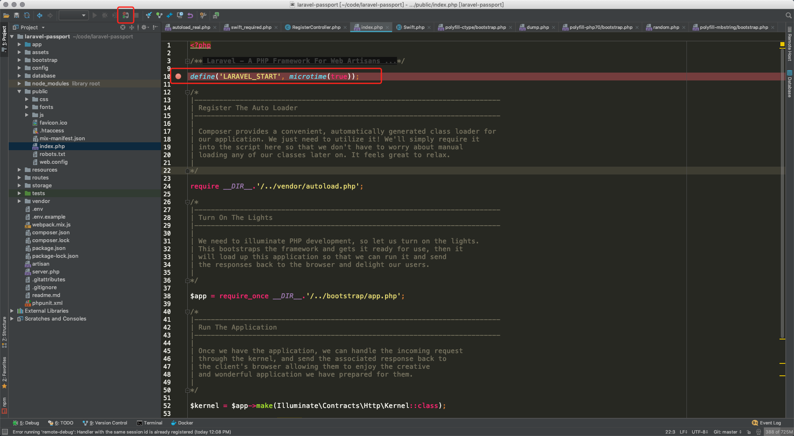
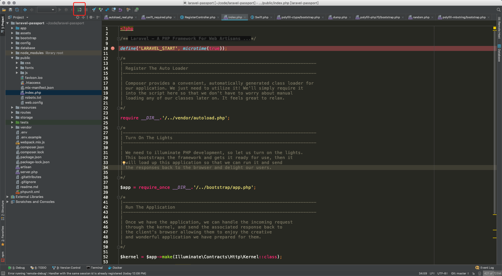

# laradock

[github 官方](https://github.com/laradock/laradock)

在这个基础上, 修改了 `.env` 的一些配合. 适合我的开发环境. 


## 目录结构

```shell
➜  code pwd
/Users/qiuyu/code
➜  code ll
total 192
drwxr-xr-x@ 60 qiuyu  staff   1.9K Aug 31 14:14 laradock
drwxr-xr-x   9 qiuyu  staff   288B Aug 10 10:00 public
drwxr-xr-x  35 qiuyu  staff   1.1K Aug 29 16:56 shop
➜  code
```

`/User/qiuyu/code` 目录下, 存放的都是项目. 其中. `laradock` 要与项目方在同级目录下.


## 自定义配置

### 修改 localhost 的路径和配置

`/Users/qiuyu/code/laradock/nginx/sites/default.conf`



 目的: 

在浏览器中打开 `localhost`, 则会显示目录. 新创建的项目, 不用配置虚拟主机就可以访问. 




### php-fpm 的 Dockerfile 文件修改



新加了 2 个 php 的扩展. 想要添加其他扩展, 可以作为参考.

新增了扩展, 需要先停止 docker

`docker-compose down`

然后重新编译

`docker-compose build php-fpm workspace`

再启动

`docker-compose up -d nginx mysql php-fpm phpmyadmin redis`

### phpstorm 使用 xdebug

#### 开启 xdebug

修改 `/Users/qiuyu/code/laradock/.env`

`WORKSPACE_INSTALL_XDEBUG=false` 改为 `WORKSPACE_INSTALL_XDEBUG=true`

`PHP_FPM_INSTALL_XDEBUG=false` 改为 `PHP_FPM_INSTALL_XDEBUG=true`

#### 修改 xdebug.ini

`/Users/qiuyu/code/laradock/php-fpm/xdebug.ini`

`/Users/qiuyu/code/laradock/workspace/xdebug.ini`

这 2 个文件, 要保持一致. 我的修改如下. 

```shell
; NOTE: The actual debug.so extention is NOT SET HERE but rather (/usr/local/etc/php/conf.d/docker-php-ext-xdebug.ini)

; xdebug.remote_host=dockerhost
xdebug.remote_host=docker.for.mac.localhost
; xdebug.remote_connect_back=1
xdebug.remote_connect_back=0
xdebug.remote_port=9001
xdebug.idekey=PHPSTORM

xdebug.remote_autostart=0
xdebug.remote_enable=0
xdebug.cli_color=0
xdebug.profiler_enable=0
xdebug.profiler_output_dir="~/xdebug/phpstorm/tmp/profiling"

xdebug.remote_handler=dbgp
xdebug.remote_mode=req

xdebug.var_display_max_children=-1
xdebug.var_display_max_data=-1
xdebug.var_display_max_depth=-1

```

其中. 有 2 个注释掉的语句. 

`; xdebug.remote_connect_back` 这个默认就是注释的. 

需要开启, 这里我用的是 mac, 查资料, 加上了这句. xdebug.remote_host=docker.for.mac.localhost

由原来默认的 `xdebug.remote_connect_back=1` 改为 `xdebug.remote_connect_back=0`

由原来默认的 `xdebug.remote_port=9000`  改为 `xdebug.remote_port=9001`.

一定要注意. `workspace` 和 `php-fpm` 下的 `xdebug.ini` 都要修改. 

#### 重新编译 php-fpm workspace

先停止docker

`docker-compose down`

重新编译

`docker-compose build php-fpm workspace`

启动 laradock

`docker-compose up -d nginx mysql php-fpm redis phpmyadmin`

查看 `phpinfo()`



显示的配置与 `xdebug.ini` 中的一致. 证明配置成功. 


#### phpstorm 中的配置


打开 phpstorm 的设置. 



这里的 `Debug port`, 改为 9001, 因为我们在 `xdebug.ini` 中设置的就是 9001, 要保持一致. 




1. 这里的 `name`, 要与 `.env` 中的 `PHP_IDE_CONFIG=serverName=laradock` 保持一致. 所以, 这里要填 `laradock`.

2. 填自己定义的虚拟主机. 就是在 nginx 中配置的虚拟域名.

3. 目录映射的地址. 项目在物理主机中和 docker 中的路径映射.

#### phpstorm 中调试

打断点



开启 xdebug





在浏览器中输入配置的虚拟主机地址. `laravel-passport.com`

phpstorm 的 xdebug 就开始工作了. 


